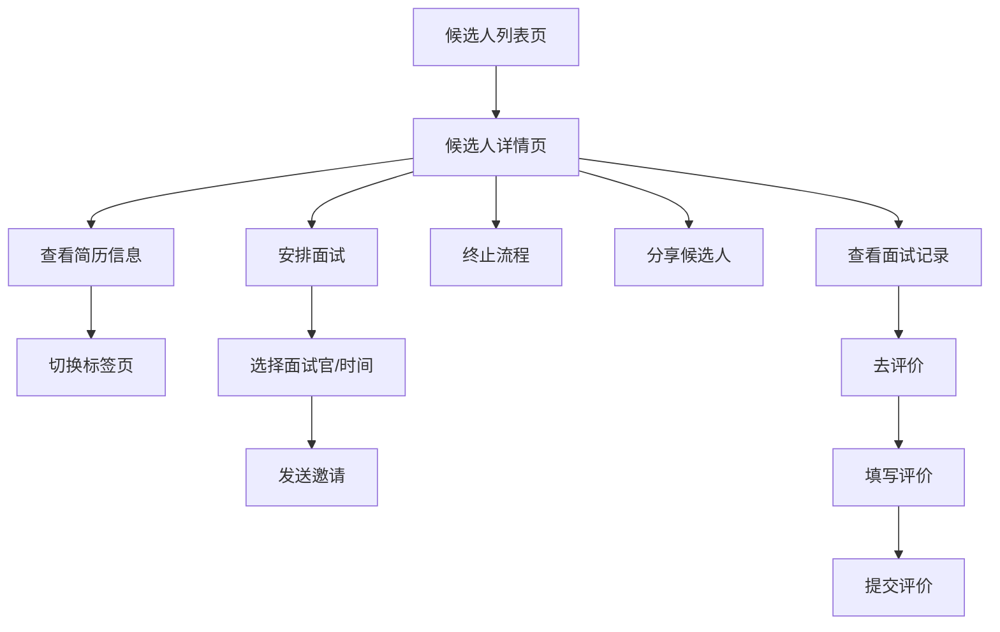

# 候选人详情页面产品需求文档

## 1. 产品概述
招聘系统候选人详情页面，用于展示候选人完整信息、面试进度及操作管理。帮助HR和面试官高效查看候选人资料、安排面试流程、记录面试评价。

## 2. 核心功能

### 2.1 用户角色

| 角色 | 注册方式 | 核心权限 |
|------|----------|----------|
| HR | 企业邮箱注册 | 查看候选人、安排面试、终止流程、添加评价 |
| 面试官 | 邀请加入 | 查看候选人简历、参与面试、提交评价 |
| 管理员 | 系统初始化 | 全部操作权限、数据导出 |

### 2.2 功能模块

候选人详情页面包含以下核心模块：

1. **候选人信息区（左侧）**：头像基本信息、标签展示、联系方式、教育经历、基本信息卡片、可扩展信息模块
2. **职位与操作区（右侧顶部）**：职位标题、状态标签、快捷操作按钮
3. **面试记录区（右侧中部）**：面试列表、面试状态、评价入口
4. **订阅与通知区**：候选人进展订阅功能

### 2.3 页面详情

| 页面模块 | 子模块 | 功能描述 |
|----------|--------|----------|
| 候选人信息区 | 头像与姓名 | 展示候选人头像、姓名、当前状态标签 |
| 候选人信息区 | 标签组 | 展示内推、985、活跃天数等标签 |
| 候选人信息区 | 联系方式 | 电话、邮箱信息展示，支持一键复制 |
| 候选人信息区 | 学历信息 | 最高学历、毕业院校、专业展示 |
| 候选人信息区 | 内容标签页 | 附件简历、标准简历、附加信息、操作记录切换 |
| 候选人信息区 | 教育经历卡片 | 时间线形式展示教育背景 |
| 候选人信息区 | 基本信息卡片 | 证件号、年龄、性别、籍贯、来源渠道等 |
| 候选人信息区 | 扩展信息区 | 添加工作经历、实习经历、项目经历等标签按钮 |
| 职位信息区 | 职位标题 | 展示投递职位名称及类型 |
| 职位信息区 | 状态标签 | 当前流程状态（面试中/已结束/待筛选等） |
| 操作按钮区 | 快捷操作 | 安排面试、终止流程、分享候选人、更多操作 |
| 人才库信息 | 来源信息 | 人才库归属、投递时间、渠道来源 |
| 订阅区 | 进展订阅 | 开启/关闭候选人进展通知 |
| 面试记录区 | 面试列表 | 按轮次展示面试记录 |
| 面试记录区 | 面试卡片 | 面试官、时间、状态、评价按钮 |

## 3. 核心流程

### 3.1 查看候选人详情流程

1. 用户从候选人列表点击进入详情页
2. 页面加载候选人基本信息、简历内容、面试记录
3. 用户可切换标签页查看不同信息
4. 用户可点击操作按钮进行面试安排等操作

### 3.2 面试安排流程

1. 点击"安排面试"按钮
2. 选择面试类型（初试/复试/终面）
3. 选择面试官和时间
4. 确认发送面试邀请

### 3.3 面试评价流程

1. 面试完成后，面试官点击"去评价"按钮
2. 填写评价表单（能力维度评分、综合评价、是否通过）
3. 提交评价，更新候选人状态

## 4. 用户界面设计

### 4.1 设计风格

- **主色调**：蓝色系（#1890FF为主色），体现专业、可信赖
- **辅助色**：灰色系用于边框和分割线（#F0F0F0、#D9D9D9）
- **状态色**：
  - 面试中：蓝色
  - 已通过：绿色
  - 已拒绝：红色
  - 待筛选：橙色
- **按钮样式**：
  - 主按钮：蓝色填充，圆角4px
  - 次按钮：白色背景+蓝色边框
  - 文字按钮：纯文字+图标
- **字体**：系统默认字体，正文14px，标题16-18px，小字12px
- **布局**：左右分栏布局，左侧固定宽度（约60%），右侧自适应
- **图标**：使用线性图标风格，保持简洁

### 4.2 页面设计概述

| 页面模块 | UI元素 | 设计说明 |
|----------|--------|----------|
| 候选人信息区 | 头像 | 64px圆形头像，带状态指示点 |
| 候选人信息区 | 姓名 | 18px加粗，黑色（#262626） |
| 候选人信息区 | 标签 | 圆角标签，不同颜色区分类型（内推-橙色、985-蓝色、活跃-绿色） |
| 候选人信息区 | 联系方式 | 图标+文字，电话和邮箱可点击 |
| 候选人信息区 | 标签页 | 顶部标签导航，下划线指示当前选中 |
| 候选人信息区 | 卡片 | 白色背景，1px灰色边框，8px圆角，16px内边距 |
| 候选人信息区 | 时间线 | 左侧竖线+圆点，右侧内容 |
| 操作按钮区 | 主按钮 | 蓝色填充，白色文字 |
| 操作按钮区 | 次按钮 | 白色填充，蓝色边框 |
| 面试记录区 | 面试卡片 | 左侧轮次标识，右侧详情 |
| 面试记录区 | 状态标签 | 小尺寸标签，颜色对应状态 |

### 4.3 响应式设计

- **桌面端优先**：默认适配1280px以上屏幕
- **平板适配**：768px-1280px，右侧区域可折叠或下移
- **交互优化**：支持点击复制联系方式、hover显示操作按钮

## 5. 交互逻辑

### 5.1 标签页切换
- 点击标签切换内容区域，无刷新加载
- 当前标签底部显示蓝色下划线

### 5.2 展开/收起
- 教育经历、工作经历等卡片支持展开收起
- 点击箭头图标切换状态

### 5.3 操作反馈
- 复制联系方式后显示Toast提示"已复制"
- 提交评价后自动刷新面试记录列表
- 终止流程需二次确认弹窗

### 5.4 加载状态
- 页面初始化显示骨架屏
- 切换标签页显示局部loading
