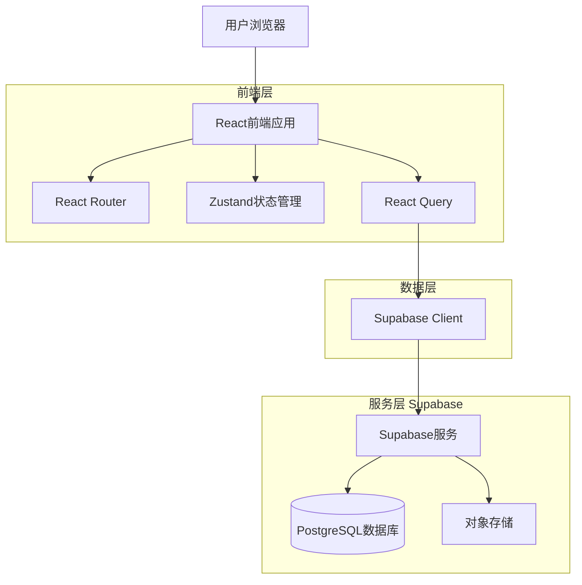
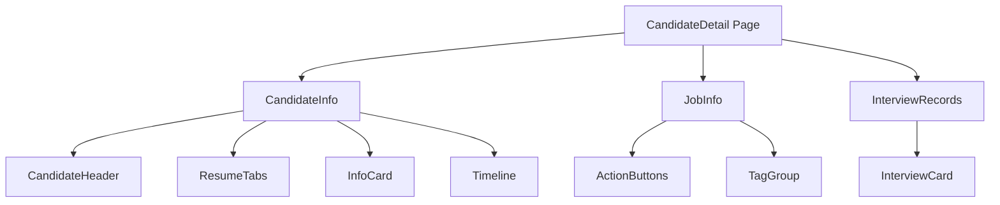
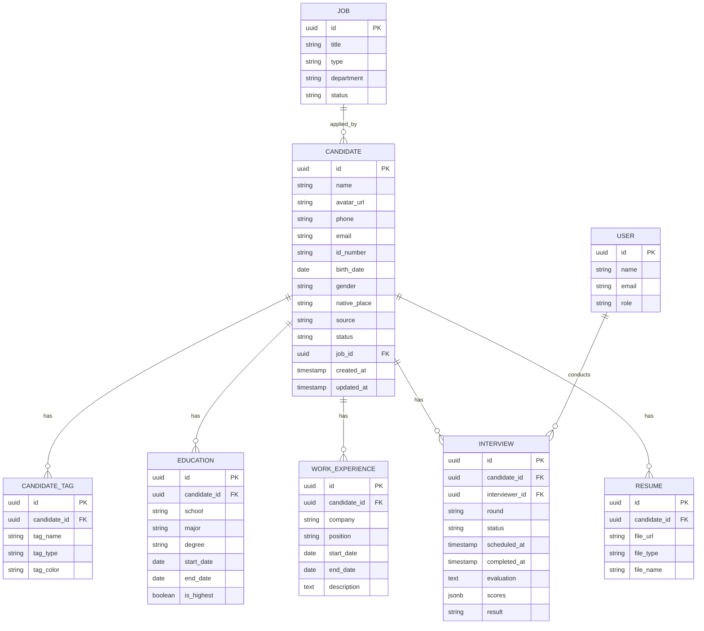

# 候选人详情页面技术架构文档

## 1. 架构设计



## 2. 技术描述

- **前端框架**: React@18 + TypeScript
- **构建工具**: Vite
- **UI组件库**: Ant Design@5
- **样式方案**: TailwindCSS@3
- **状态管理**: Zustand
- **数据获取**: React Query (TanStack Query)
- **路由**: React Router@6
- **后端服务**: Supabase
- **数据库**: PostgreSQL (通过Supabase)
- **文件存储**: Supabase Storage

## 3. 路由定义

| 路由 | 用途 |
|------|------|
| /candidates | 候选人列表页 |
| /candidates/:id | 候选人详情页（本文档目标页面） |
| /candidates/:id/interview | 安排面试弹窗/页面 |
| /candidates/:id/evaluation | 面试评价页面 |
| /jobs/:id | 职位详情页 |

## 4. 组件结构

### 4.1 页面组件

```
src/
├── pages/
│   └── CandidateDetail/
│       ├── index.tsx                 # 主页面
│       ├── CandidateInfo.tsx         # 左侧候选人信息区
│       ├── JobInfo.tsx               # 右侧职位信息区
│       ├── InterviewRecords.tsx      # 面试记录列表
│       └── styles.module.css         # 页面样式
```

### 4.2 通用组件

```
src/
├── components/
│   ├── CandidateHeader/              # 候选人头部信息
│   ├── InfoCard/                     # 信息卡片组件
│   ├── Timeline/                     # 时间线组件
│   ├── TagGroup/                     # 标签组组件
│   ├── InterviewCard/                # 面试记录卡片
│   ├── ResumeTabs/                   # 简历标签页
│   └── ActionButtons/                # 操作按钮组
```

### 4.3 组件层级关系



## 5. 数据模型

### 5.1 数据模型定义



### 5.2 数据定义语言

```sql
-- 候选人表
CREATE TABLE candidates (
    id UUID PRIMARY KEY DEFAULT gen_random_uuid(),
    name VARCHAR(100) NOT NULL,
    avatar_url TEXT,
    phone VARCHAR(20),
    email VARCHAR(255),
    id_number VARCHAR(50),
    birth_date DATE,
    gender VARCHAR(10),
    native_place VARCHAR(100),
    source VARCHAR(50),
    status VARCHAR(50) DEFAULT 'pending',
    job_id UUID REFERENCES jobs(id),
    created_at TIMESTAMP WITH TIME ZONE DEFAULT NOW(),
    updated_at TIMESTAMP WITH TIME ZONE DEFAULT NOW()
);

-- 候选人标签表
CREATE TABLE candidate_tags (
    id UUID PRIMARY KEY DEFAULT gen_random_uuid(),
    candidate_id UUID REFERENCES candidates(id) ON DELETE CASCADE,
    tag_name VARCHAR(50) NOT NULL,
    tag_type VARCHAR(30),
    tag_color VARCHAR(20)
);

-- 教育经历表
CREATE TABLE educations (
    id UUID PRIMARY KEY DEFAULT gen_random_uuid(),
    candidate_id UUID REFERENCES candidates(id) ON DELETE CASCADE,
    school VARCHAR(200) NOT NULL,
    major VARCHAR(200),
    degree VARCHAR(50),
    start_date DATE,
    end_date DATE,
    is_highest BOOLEAN DEFAULT false
);

-- 工作经历表
CREATE TABLE work_experiences (
    id UUID PRIMARY KEY DEFAULT gen_random_uuid(),
    candidate_id UUID REFERENCES candidates(id) ON DELETE CASCADE,
    company VARCHAR(200) NOT NULL,
    position VARCHAR(200),
    start_date DATE,
    end_date DATE,
    description TEXT
);

-- 面试记录表
CREATE TABLE interviews (
    id UUID PRIMARY KEY DEFAULT gen_random_uuid(),
    candidate_id UUID REFERENCES candidates(id) ON DELETE CASCADE,
    interviewer_id UUID REFERENCES users(id),
    round VARCHAR(50) NOT NULL,
    status VARCHAR(50) DEFAULT 'scheduled',
    scheduled_at TIMESTAMP WITH TIME ZONE,
    completed_at TIMESTAMP WITH TIME ZONE,
    evaluation TEXT,
    scores JSONB,
    result VARCHAR(50)
);

-- 简历文件表
CREATE TABLE resumes (
    id UUID PRIMARY KEY DEFAULT gen_random_uuid(),
    candidate_id UUID REFERENCES candidates(id) ON DELETE CASCADE,
    file_url TEXT NOT NULL,
    file_type VARCHAR(50),
    file_name VARCHAR(255)
);

-- 职位表
CREATE TABLE jobs (
    id UUID PRIMARY KEY DEFAULT gen_random_uuid(),
    title VARCHAR(200) NOT NULL,
    type VARCHAR(50),
    department VARCHAR(100),
    status VARCHAR(50) DEFAULT 'active'
);

-- 创建索引
CREATE INDEX idx_candidates_job_id ON candidates(job_id);
CREATE INDEX idx_candidates_status ON candidates(status);
CREATE INDEX idx_candidate_tags_candidate_id ON candidate_tags(candidate_id);
CREATE INDEX idx_educations_candidate_id ON educations(candidate_id);
CREATE INDEX idx_work_experiences_candidate_id ON work_experiences(candidate_id);
CREATE INDEX idx_interviews_candidate_id ON interviews(candidate_id);

-- 权限设置
GRANT SELECT ON candidates TO anon;
GRANT ALL PRIVILEGES ON candidates TO authenticated;
GRANT SELECT ON candidate_tags TO anon;
GRANT ALL PRIVILEGES ON candidate_tags TO authenticated;
GRANT SELECT ON educations TO anon;
GRANT ALL PRIVILEGES ON educations TO authenticated;
GRANT SELECT ON work_experiences TO anon;
GRANT ALL PRIVILEGES ON work_experiences TO authenticated;
GRANT SELECT ON interviews TO anon;
GRANT ALL PRIVILEGES ON interviews TO authenticated;
GRANT SELECT ON resumes TO anon;
GRANT ALL PRIVILEGES ON resumes TO authenticated;
GRANT SELECT ON jobs TO anon;
GRANT ALL PRIVILEGES ON jobs TO authenticated;
```

## 6. API定义

### 6.1 获取候选人详情

```typescript
// GET /api/candidates/:id
interface GetCandidateDetailRequest {
  id: string;
}

interface GetCandidateDetailResponse {
  id: string;
  name: string;
  avatar_url: string;
  phone: string;
  email: string;
  id_number: string;
  birth_date: string;
  gender: string;
  native_place: string;
  source: string;
  status: 'pending' | 'interviewing' | 'offered' | 'rejected' | 'hired';
  job: {
    id: string;
    title: string;
    type: string;
  };
  tags: {
    id: string;
    tag_name: string;
    tag_type: string;
    tag_color: string;
  }[];
  educations: {
    id: string;
    school: string;
    major: string;
    degree: string;
    start_date: string;
    end_date: string;
  }[];
  work_experiences: {
    id: string;
    company: string;
    position: string;
    start_date: string;
    end_date: string;
  }[];
  interviews: {
    id: string;
    round: string;
    status: string;
    scheduled_at: string;
    interviewer: {
      id: string;
      name: string;
    };
    result: string;
  }[];
  created_at: string;
}
```

### 6.2 安排面试

```typescript
// POST /api/interviews
interface CreateInterviewRequest {
  candidate_id: string;
  interviewer_id: string;
  round: string;
  scheduled_at: string;
}

interface CreateInterviewResponse {
  id: string;
  candidate_id: string;
  status: string;
  scheduled_at: string;
}
```

### 6.3 提交面试评价

```typescript
// PUT /api/interviews/:id/evaluation
interface SubmitEvaluationRequest {
  interview_id: string;
  scores: {
    professional: number;
    communication: number;
    logic: number;
    overall: number;
  };
  evaluation: string;
  result: 'pass' | 'fail' | 'pending';
}

interface SubmitEvaluationResponse {
  id: string;
  status: string;
  result: string;
  completed_at: string;
}
```

### 6.4 终止流程

```typescript
// PUT /api/candidates/:id/status
interface UpdateCandidateStatusRequest {
  status: 'rejected' | 'offered' | 'hired';
  reason?: string;
}

interface UpdateCandidateStatusResponse {
  id: string;
  status: string;
  updated_at: string;
}
```

## 7. 状态管理

### 7.1 Zustand Store结构

```typescript
interface CandidateDetailState {
  // 数据状态
  candidate: Candidate | null;
  interviews: Interview[];
  isLoading: boolean;
  error: Error | null;
  
  // UI状态
  activeTab: 'attachment' | 'standard' | 'additional' | 'history';
  expandedCards: Set<string>;
  
  // 操作
  fetchCandidate: (id: string) => Promise<void>;
  setActiveTab: (tab: string) => void;
  toggleCard: (cardId: string) => void;
  refreshInterviews: () => Promise<void>;
}
```

### 7.2 React Query配置

```typescript
// 候选人详情查询
const useCandidateDetail = (id: string) => {
  return useQuery({
    queryKey: ['candidate', id],
    queryFn: () => fetchCandidateDetail(id),
    enabled: !!id,
    staleTime: 5 * 60 * 1000, // 5分钟
  });
};

// 面试记录查询
const useCandidateInterviews = (candidateId: string) => {
  return useQuery({
    queryKey: ['interviews', candidateId],
    queryFn: () => fetchCandidateInterviews(candidateId),
    enabled: !!candidateId,
  });
};
```

## 8. 性能优化

### 8.1 数据加载策略
- 使用React Query实现数据缓存和自动刷新
- 候选人详情数据缓存5分钟
- 面试记录实时性要求高，缓存1分钟

### 8.2 组件优化
- 使用React.memo优化列表渲染
- 使用useMemo缓存计算结果
- 使用useCallback缓存回调函数

### 8.3 图片优化
- 头像使用WebP格式
- 简历文件按需加载
- 使用懒加载减少初始加载时间
